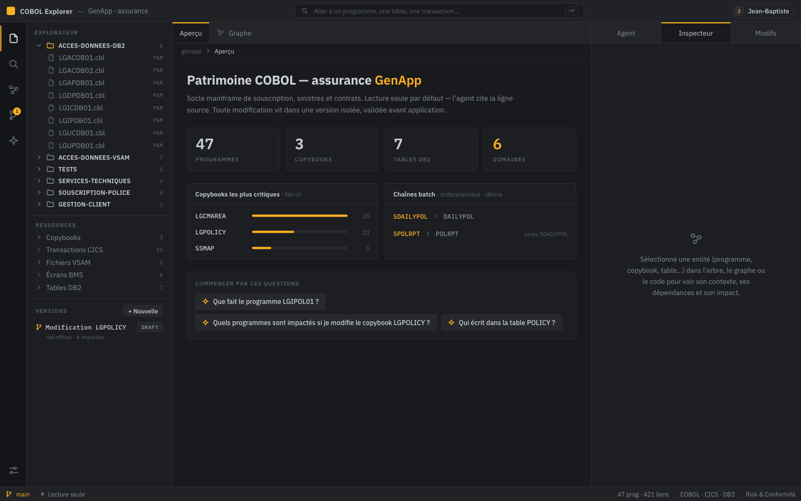
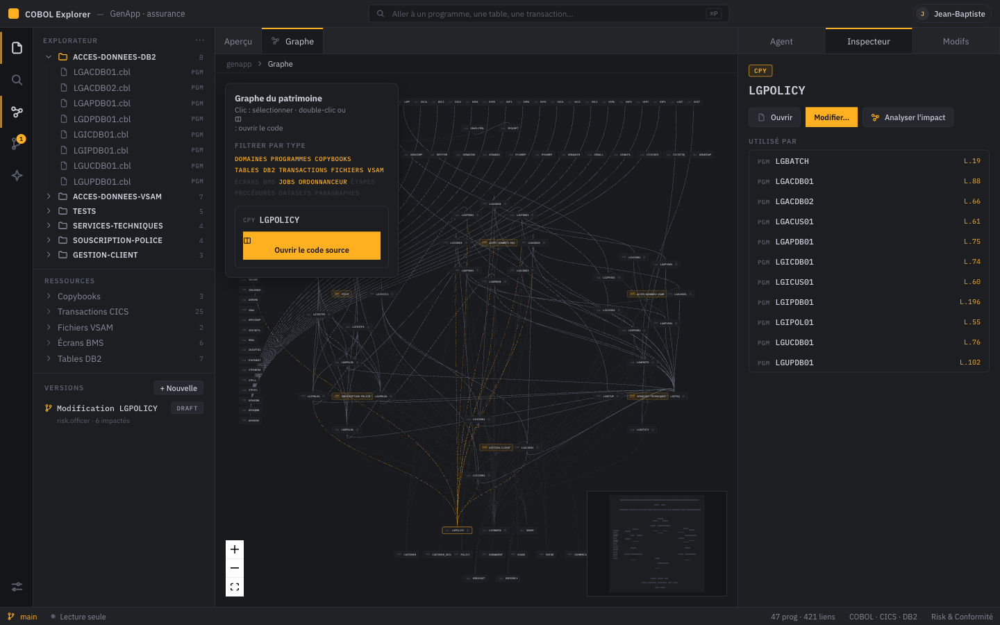
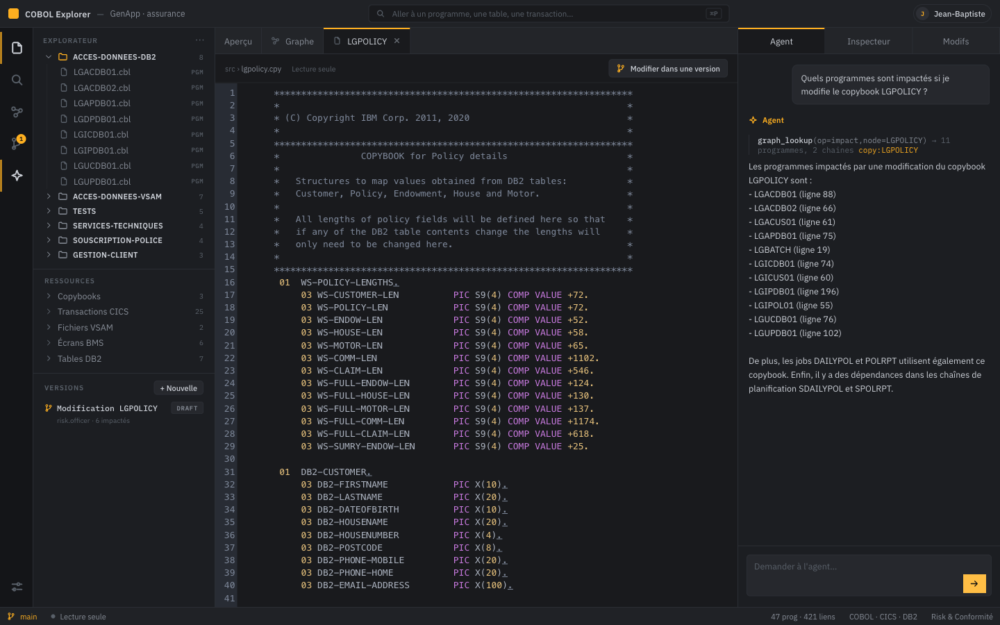

<div align="center">

# COBOL Explorer
### L'atelier IA pour **comprendre** et **modifier sûrement** un patrimoine mainframe

*Grounded agentic RAG + graphe mainframe-natif — chaque réponse tracée jusqu'à la ligne source.*

**IBM AI Builders Challenge with IBM Bob** · **Wildcard Challenge — Build Intelligent Systems for the Future of Work**

[](https://cobol-explorer.fr)
[](#8-tests)
[](https://www.ibm.com/granite)
[](#5-toute-la-stack-ibm)
[](LICENSE)

</div>

---

## 🏆 AI Builders Challenge with IBM Bob — submission (Wildcard)

> An **AI co-worker + decision-intelligence platform** that turns work on legacy mainframe code — today a set of disconnected, expert-dependent tasks — into an **intelligent, governed, outcome-driven system** for a whole team (developers · risk · compliance).

### Problem statement
Legacy mainframe estates (COBOL / z/OS) still run the world's banks, insurers and public services — **200+ billion lines of COBOL in production**. But the *work* of understanding and safely changing them is stuck in the past: **disconnected, manual, expert-dependent tasks** — grep the files, ask a graybeard who's about to retire, then *guess* the blast radius of a change. Non-technical **risk and compliance** teams can't read the code at all. Every change is a gamble, because its true impact is unknowable — and "found 8 of 14 impacted programs" is a production incident.

### Solution description
**COBOL Explorer** ingests the whole estate (COBOL, JCL, CICS, DB2, BMS, scheduler) into a **dependency graph**, and lets anyone — dev or business — ask questions in natural language and get answers **grounded to the exact source line**. It turns disconnected tasks into an outcome-driven system across the four "Future of Work" verbs:
- **Plan** — exhaustive, deterministic **impact analysis** ("changing this copybook breaks these N programs and these batch chains, with proof").
- **Coordinate** — **team versioning**: isolated branches, affected owners, review, merge-gate.
- **Decide** — grounded, cited, exhaustive answers (decision support), not a plausible sample.
- **Execute** — **propose** an isolated change → measure impact → **governed merge** → tamper-proof audit.

### AI approach and architecture
- **Agentic RAG** — a **BeeAI** RequirementAgent on **IBM Granite** (ReAct loop); the agent chooses which tool to call and logs *why* (a `think` step), so its reasoning is auditable.
- **Two complementary RAGs** — a **graph RAG** (Neo4j, deterministic traversal → exact impact / lineage / call-graph) and a **vector RAG** (pgvector + **IBM Granite embeddings** → semantic search by intent). Hybrid routing by the agent.
- **Grounding / anti-hallucination** — every answer cites `file:line`, re-verified against the corpus.
- **IBM Bob via MCP** — 3 tools (`graph_lookup`, `search_code`, `read_source_lines`) exposed over the Model Context Protocol, so **Bob itself becomes an AI co-worker** that can query the estate.
- **Governance** — git-backed team versioning, RBAC roles, merge-gate, HMAC-chained immutable audit.
- **Multi-system** — analyzes **two real estates**: IBM **GenApp** (insurance) and AWS **CardDemo** (credit cards), switchable in one click.
- **Stack** — Python / FastAPI (agent + ingestion) + React / TypeScript (frontend); self-hosted Neo4j + pgvector + Granite (Ollama), or **Granite on IBM watsonx.ai**. 123 backend tests · 31 e2e.

### Try it
**Live: [cobol-explorer.fr](https://cobol-explorer.fr)** — create an account, or sign in with the demo account
`amine` / `demo`. The agent runs on `ibm/granite-4-h-small` hosted on watsonx.ai (Dallas).

### Known limitations
Stated plainly, because a reviewer will find them anyway:
- **Accounts are file-based** (demo-grade). A real deployment plugs the corporate IdP — the token and RBAC path is
  unchanged, only the account source moves.
- **One active estate per process.** Switching between GenApp and CardDemo is a process-wide setting, so the public
  demo is effectively single-session.
- **Neo4j covers the traversals**, but name resolution and node attributes are still served from the in-memory
  index; full decoupling is a fast-follow.
- **The scheduler chains for GenApp are synthetic** (a JSON export standing in for IWS/Control-M). CardDemo's batch
  is real.
- **Embeddings are Granite via Ollama**, not watsonx — the corpus is not re-embedded when the chat backend switches.

### Selected challenge theme
**Wildcard — *Build Intelligent Systems for the Future of Work*.** COBOL Explorer is a **decision-intelligence platform** and **AI co-worker** for the millions of people who maintain the systems that run critical infrastructure: it uses AI to **reduce repetitive work** (manual impact hunting), **improve decision-making** (exhaustive grounded impact), and **help teams reach outcomes faster** (a governed collaboration workflow) — spanning technical and non-technical roles.

### How IBM Bob was used
- **Bob as a runtime AI co-worker (integrated):** COBOL Explorer exposes its analysis tools to **IBM Bob over MCP** (`.bob/mcp.json`). A developer working inside Bob can ask *"what breaks if I change LGPOLICY?"* and Bob calls `graph_lookup` — returning the exhaustive, grounded impact that a file-reading agent alone cannot guarantee.
- **Bob as the development environment — spec-driven, with reusable skills.** The project was driven the way the
  official July lab teaches: *spec-driven development* rather than vibe coding. Each unit of work started as an
  intent, became a written plan, and only then became code. On top of that, **reusable skills** were layered into
  Bob so the same discipline applied every time:
  - a **brainstorming skill** — requirements and design settled *before* any implementation, so the spec is the
    artefact and the code follows it;
  - a **test-driven skill** — the failing test first. It is the reason this repository ships **123 backend tests**
    rather than a happy-path demo;
  - a **simplify skill** — a cleanup pass re-reading the diff for duplication, dead code and over-engineering.
    Concrete outcomes: a dead `_copy_evidence` helper removed, an MCP `domain` parameter that Bob could see but that
    filtered nothing removed from the tool signature, and a hard-coded `.bob/mcp.json` path made portable.
- **The loop closes:** Bob helped build the tool that now extends Bob. The same three tools
  (`graph_lookup`, `search_code`, `read_source_lines`) are exposed back to Bob over MCP.
- **IBM SkillsBuild:** *"Troubleshoot Your Code Using IBM Bob"* completed; certificate submitted with the entry.

**Deliverables** — public GitHub repo (this) · demo/presentation video (≤ 3 min) · each member completes an IBM SkillsBuild "IBM Bob" activity.

---

> « L'IA ne parle pas au mainframe. Elle parle à un graphe et un index construits à partir du code, du JCL et de l'ordonnanceur — et chaque réponse est tracée jusqu'à la ligne source exacte. »

## Aperçu

**La plateforme — un atelier façon VS Code (barre d'activité, explorateur, éditeur à onglets, panneau agent).**



| Le graphe du patrimoine — sélection + impact « utilisé par » | Le code + l'agent traçable (réponse citée jusqu'à la ligne) |
|---|---|
|  |  |

> Depuis le graphe : **clic** sur une node = sélection (l'inspecteur montre le contexte), **double-clic** / icône `‹›` = ouvre le code dans un onglet au centre. Onglets mixtes (aperçu · graphe · code · diff).

---

## 1. Le produit en deux gestes

Le produit sépare proprement **comprendre** (sans effet de bord) et **modifier** (isolé, tracé, révisé).

### 🔎 Interroger / Comprendre
Explorer et questionner le patrimoine **sans jamais le toucher** : navigation, lecture du code, dépendances, impact, et un **agent** qui répond en citant les lignes source. Toutes ces opérations sont en lecture seule.

### ✎ Modifier — avec des *workflows* (change-sets)
Toute modification vit dans une **version isolée** (un change-set, comme une branche/PR) : on édite le code, on **voit l'impact** (programmes + chaînes batch touchés), on compare avec un **diff**, on **commente** et on **révise** (statut *draft → proposed → merged*). **Le corpus source n'est jamais muté** — les édits vivent dans `versions/<id>/files/`. C'est le workflow « proposer un changement (ex. une valeur d'assurance qui bouge) → mesurer son impact avant de l'appliquer ».

> Les deux gestes se renforcent : *on comprend → on propose un changement → on voit l'impact → on révise.*

---

## 2. Ce que le produit **visualise** (les éléments mainframe)

Le graphe est **mainframe-natif** : il ne montre pas « du COBOL », il montre le patrimoine réel.

**Nœuds (éléments) :**
`DOMAINE métier` · `PROGRAMME (COBOL)` · `PARAGRAPHE` · `COPYBOOK` · `TABLE DB2` · `TRANSACTION CICS` · `ÉCRAN (BMS)` · `JOB (JCL)` · `STEP` · `PROC` · `DATASET / GDG` · `CHAÎNE D'ORDONNANCEUR`

**Relations (arêtes), chacune avec sa *preuve* (fichier:ligne, DDNAME, verbe) :**
`contient` · `exécute` · `appelle` (CALL + CICS LINK) · `copie` (données | procédure + REPLACING) · `lit/écrit une table DB2` (EXEC SQL) · `lit/écrit un dataset` (lignée SELECT↔DD↔DSN) · `déclenche` / `précède` (ordonnanceur) · `regroupe par domaine`

C'est ce qui permet des réponses impossibles à un « RAG sur du code » : **lignée de données batch**, **chaînes d'ordonnanceur**, et **analyse d'impact par copybook** (« changer ce copybook casse ces N programmes et ces chaînes »).

> 📐 **Couverture de l'univers mainframe** (ce qu'on mappe vs IMS/MQ/CICS-resources/PL-I/Assembleur/RACF… et la roadmap) : voir [docs/COUVERTURE-UNIVERS-MAINFRAME.md](docs/COUVERTURE-UNIVERS-MAINFRAME.md). Le schéma (nœuds + arêtes typés) est **agnostique du langage/sous-système** : étendre = ajouter un `kind` + un parseur, pas une refonte.

---

## 3. Les **visualisations** (surfaces de l'interface)

Atelier de type IDE / cowork, en 3 colonnes :

| Surface | Ce qu'elle montre |
|---|---|
| **Aperçu** (onglet) | Orientation : stats du patrimoine, **top copybooks par fan-in** (criticité), **chaînes batch** de l'ordonnanceur, questions de départ |
| **Navigateur** (gauche) | Arbre du patrimoine **par domaine métier** (programmes, copybooks) + recherche + liste des **versions** |
| **Éditeur de code** (onglet) | Le code COBOL en ligne — **CodeMirror**, coloration, numéros de ligne, onglets multi-fichiers |
| **Graphe** (onglet) | Graphe de dépendances **groupé par domaine**, arêtes **colorées par sémantique** (appel ambre animé, copybook cyan, SQL violet, exécution vert…) |
| **Inspecteur** (droite) | Contexte d'une entité : dépendances **cliquables avec n° de ligne** (appelle, copybooks, tables, **utilisé par**, appelé par) + **analyse d'impact** groundée |
| **Chat** (droite) | L'agent : réponse **groundée**, **trace des appels d'outils**, citations `fichier:ligne` |
| **Modifs** (droite) | La revue *cowork* : **fichiers modifiés** de la version + **diff** + impact + **Proposer/Fusionner/commenter** |
| **Barre de commande** (haut) | Recherche globale, statistiques, version active |

---

## 4. L'agent et **tous ses outils**

Agent **BeeAI `RequirementAgent`** (IBM Granite via Ollama), boucle ReAct, **chaque appel d'outil tracé** (grounding auditable, streamé en SSE). Instruit pour **poser une question de clarification** si la demande est ambiguë.

| Outil | Ce qu'il fait |
|---|---|
| `graph_lookup` | Requête sur le graphe : **impact**, **lignée**, **appelants**, **appelés**, **voisins** (déterministe) |
| `search_code` | **Recherche sémantique** sur le code (IBM **Granite embeddings**) — l'agent peut la combiner avec `graph_lookup` (vecteur + graphe) |
| `read_source_lines` | Lit les **lignes source exactes** pour citer (`fichier:ligne`) |
| `web_search` | Contexte externe (réglementation, définitions) — Tavily ou DuckDuckGo |
| `propose_change` | **Crée une version** (change-set) proposant une modif et **calcule son impact** — depuis le chat |

Les mêmes outils (`graph_lookup`, `read_source_lines`, `search_code`) sont **exposés en MCP** → utilisables directement depuis **IBM Bob**.

---

## 5. **Toute la stack IBM**

| Couche | Techno IBM | Usage |
|---|---|---|
| **Raisonnement (LLM)** | **IBM Granite** (`granite3.3`, via Ollama) | le cerveau de l'agent |
| **Embeddings / recherche** | **IBM Granite Embedding** (`granite-embedding`) | la recherche sémantique `search_code` |
| **Framework d'agent** | **BeeAI** (`RequirementAgent`) | orchestration ReAct + trace |
| **Assistant de dev** | **IBM Bob** | (1) copilote de construction ; (2) **client MCP** de nos outils |

**Protocole d'outils** : **MCP** — standard *ouvert* (Anthropic), **adopté par IBM Bob**. Nos outils (`graph_lookup`, `search_code`, `read_source_lines`) sont exposés en MCP → consommables par tout client MCP, dont Bob une fois le serveur enregistré (non encore vérifié contre Bob en direct).

**Neutre (pas d'équivalent IBM pertinent)** : extraction regex maison (parsing COBOL/JCL/CICS), cobol-rekt (validateur optionnel, non-IBM), FastAPI/React/CodeMirror/NetworkX (plomberie), Tavily/DuckDuckGo (web search).
**Options IBM roadmap** : Docling (ingestion doc), MCP **Context Forge** (passerelle MCP), **watsonx.governance** (audit), **watsonx.ai** (Granite managé pour une démo cloud).

> Tout tourne **localement et gratuitement** — reproductible par un étudiant.

---

## 6. Architecture

```
INGESTION (offline, Python)
  corpus COBOL/JCL ─► extraction ciblée de constructs (COBOL COPY/CALL/EXEC CICS/EXEC SQL/
                      SELECT-ASSIGN/SEND-MAP, JCL JOB/STEP/DD, CSD transactions, BMS maps)
                      ─► graph.json (NetworkX)  ─► chunks ─► IBM Granite embeddings ─► index.json
                      (cobol-rekt = validation/enrichissement OPTIONNEL hors-graphe, nécessite un JDK)
SERVICE (Python)
  FastAPI  ── /graph /impact /source /file /search ── /ask (SSE) ── /changesets…
     └─ Agent BeeAI (IBM Granite) : graph_lookup · search_code · read_source_lines · web_search · propose_change
     └─ serveur MCP  ── outils consommables par IBM Bob
  Versioning : change-sets isolés + impact + diff + revue (collaboration)
FRONTEND (React + CodeMirror + React Flow) — atelier IDE/cowork
  nav (arbre + versions) · onglets (Aperçu / Code / Graphe) · droite (Chat / Inspecteur / Modifs)
```

## 7. Démarrer

```bash
make setup    # venv (uv) + deps Python + deps front
make ingest   # corpus -> graph.json (GenApp : 339 nœuds / 421 arêtes ; CardDemo : 1157 / 1294)
make index    # index sémantique IBM Granite -> index.json
make web      # build du front
make serve    # http://127.0.0.1:8000
# agent conversationnel : ollama serve & ; ollama pull granite3.3:8b granite-embedding:278m
make ask N=LGPOLICY   # réponse groundée+tracée en CLI (sans LLM)
make mcp              # serveur MCP pour IBM Bob
```

### 7.0 Où tourne Granite (Ollama ou watsonx.ai)

Le modèle est **toujours IBM Granite** ; seule son exécution change, via `COBOL_EXPLORER_MODEL` :

| Valeur | Modèle | Exécution | Latence agent mesurée |
|---|---|---|---|
| `ollama:granite3.3:8b` (défaut) | Granite 3.3 8B | **auto-hébergée**, sur la machine — le code du patrimoine ne sort jamais | ~30-40 s (CPU) |
| `watsonx:ibm/granite-4-h-small` | Granite 4.0 H Small | **IBM watsonx.ai** (région Dallas) | **~6,5 s** |

```bash
make serve            # Granite auto-hébergé via Ollama
make serve-watsonx    # Granite hébergé par IBM watsonx.ai
```

Pour watsonx, renseigner `WATSONX_API_KEY`, `WATSONX_PROJECT_ID` et
`WATSONX_URL=https://us-south.ml.cloud.ibm.com` (fichier `.env`, non versionné). Le projet
watsonx doit avoir un service **watsonx.ai Runtime** associé, sinon l'appel échoue en 403
`no_associated_service_instance_error` — l'erreur ne mentionne pas la cause réelle.

### 7.0-bis Inscription et vérification d'adresse

L'inscription est ouverte (`POST /api/signup`). Si un relais SMTP est configuré, le compte est créé
**non vérifié** et un lien de confirmation à usage unique (24 h) part par e-mail ; la connexion est
refusée en 403 tant qu'il n'est pas cliqué. **Sans relais configuré, la vérification est désactivée**
et le visiteur entre directement — l'API le dit (`/api/auth/config` → `email_verification: false`),
donc l'interface ne prétend jamais avoir envoyé un e-mail qu'elle n'a pas envoyé.

Aucun service tiers : du SMTP standard, avec la boîte du domaine.

```bash
COBOL_EXPLORER_SMTP_HOST=smtp.ionos.fr
COBOL_EXPLORER_SMTP_PORT=587            # 587 STARTTLS · 465 TLS implicite
COBOL_EXPLORER_SMTP_USER=noreply@cobol-explorer.fr
COBOL_EXPLORER_SMTP_PASSWORD=...
COBOL_EXPLORER_SMTP_FROM="COBOL Explorer <noreply@cobol-explorer.fr>"
COBOL_EXPLORER_PUBLIC_URL=https://cobol-explorer.fr
```

### 7.0-ter « Sign in with IBM » (OIDC / IBM Cloud App ID)

Deux échanges OAuth 2.0 cohabitent dans le projet, et il ne faut pas les confondre :

| | Qui | Quoi |
|---|---|---|
| **Machine à machine** | `ibm_watsonx_ai` | la clé API est échangée contre un jeton IAM (`grant_type=urn:ibm:params:oauth:grant-type:apikey`) pour appeler Granite |
| **Humain** | `security/oidc.py` | une **personne** se connecte via **IBM Cloud App ID** (authorization code), et ses claims sont mappés sur le même jeton signé que le reste de l'app |

Le rôle accordé à une connexion IBM est volontairement **le moins privilégié qui reste utile**
(`risk` : lire et proposer, jamais fusionner). Fédérer une identité dit *qui* est quelqu'un, pas ce
qu'il a le droit de faire ici — ça reste une décision de ce déploiement.

Le jeton revient au SPA **dans le fragment d'URL** : un fragment n'est jamais envoyé au serveur, donc
il n'apparaît dans aucun log d'accès ni dans l'en-tête `Referer`. Il est lu une fois puis effacé de la
barre d'adresse. L'état CSRF est **signé** plutôt que stocké (10 minutes de validité), pour qu'un
redémarrage ne fasse pas échouer les connexions en cours.

```bash
COBOL_EXPLORER_OIDC_TENANT=<guid du tenant App ID>
COBOL_EXPLORER_OIDC_REGION=us-south
COBOL_EXPLORER_OIDC_CLIENT_ID=...
COBOL_EXPLORER_OIDC_SECRET=...
COBOL_EXPLORER_OIDC_ROLE=risk
```

Sans ces variables, le bouton n'est pas proposé (`/api/auth/config` → `ibm_sign_in: false`).

### 7.1 Authentification (qui est l'utilisateur ?)

Le serveur tourne dans l'un de trois modes, via `COBOL_EXPLORER_AUTH` :

| Mode | Identité | Pour quoi |
|---|---|---|
| `open` (défaut) | en-têtes `X-Cobol-User` / `X-Cobol-Role`, déclaratifs | démo — `make serve`, rien à configurer |
| `jwt` | **login + jeton signé HS256** émis par `/api/login` | déploiement autonome — `make serve-auth` |
| `enforce` | en-têtes injectés par un reverse-proxy SSO de confiance | l'entreprise garde l'authentification hors de l'app (OIDC/SAML) |

En mode `jwt`, le **rôle voyage dans le jeton signé** : un client ne peut pas se promouvoir en changeant un
en-tête, RBAC arbitre à partir des *claims*, et chaque tentative — acceptée, refusée ou rejetée — part dans le
journal d'audit chaîné. Le mot de passe n'est jamais stocké (PBKDF2-HMAC-SHA256, 120 000 itérations, sel par compte).

```bash
make serve-auth   # même app, authentification réelle activée
# comptes de démo (mot de passe : demo) — un par geste, pour voir RBAC mordre :
#   amine (dev) · claire (architect) · sofia (risk) · marc (auditor, lecture seule)
```

Comptes réels : pointer `COBOL_EXPLORER_USERS` sur un JSON `{user: {display, role, password_hash}}`
(hachage via `security.users.hash_password`), et fixer `COBOL_EXPLORER_JWT_SECRET` pour que les
jetons survivent à un redémarrage.

## 8. Tests

```bash
make test                          # 146 tests backend (parsing, graphe, impact, recherche, versioning, API, MCP, auth, inscription)
cd web && pnpm exec playwright test # 35 e2e (landing, inscription, connexion, aperçu, code, impact, cowork)
make serve-sandbox &                # serveur authentifié sur une COPIE jetable du patrimoine
make e2e-governance                 # scénario 3 comptes / 3 rôles joué au navigateur
```

## 9. Positionnement

- vs **watsonx Code Assistant for Z** : **complément** (compréhension / onboarding humain), pas concurrent.
- vs **Phase Change** (« graphe déterministe ») : on ajoute le **raisonnement agentique auditable** (trace des tool calls) au-dessus d'un graphe déterministe.

Licence : **Apache 2.0**.
