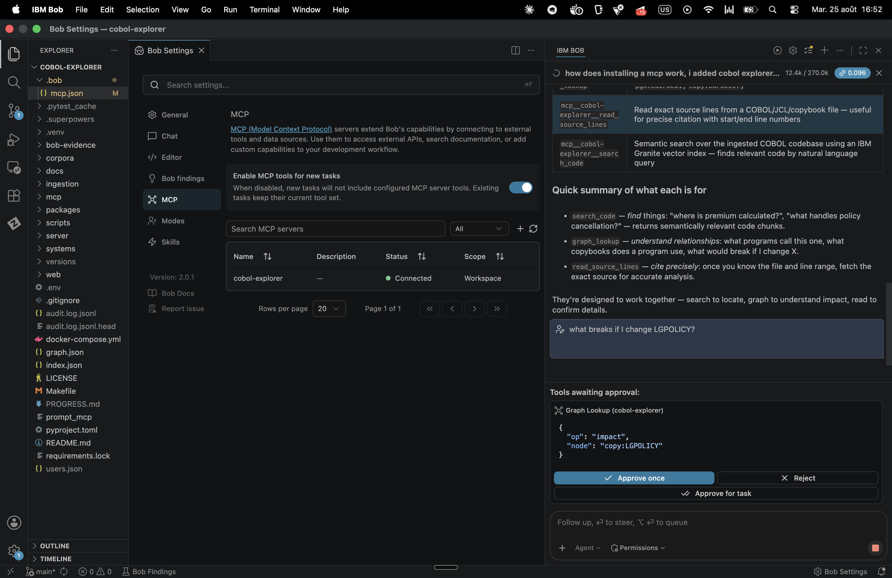
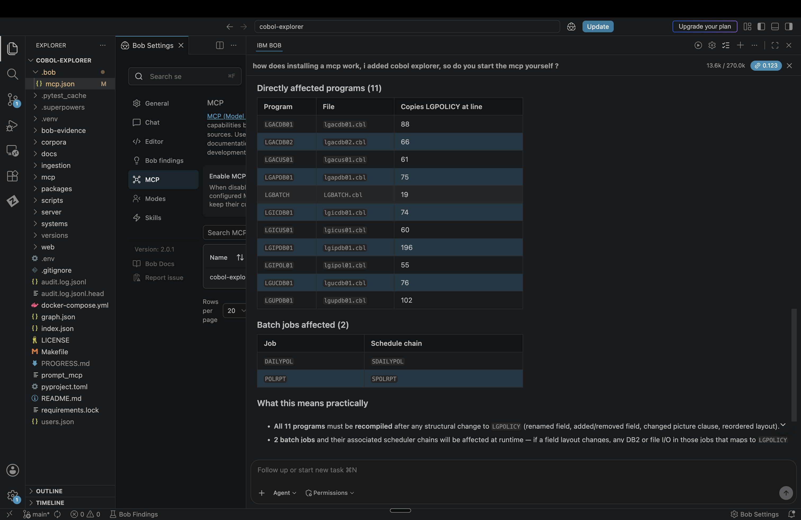
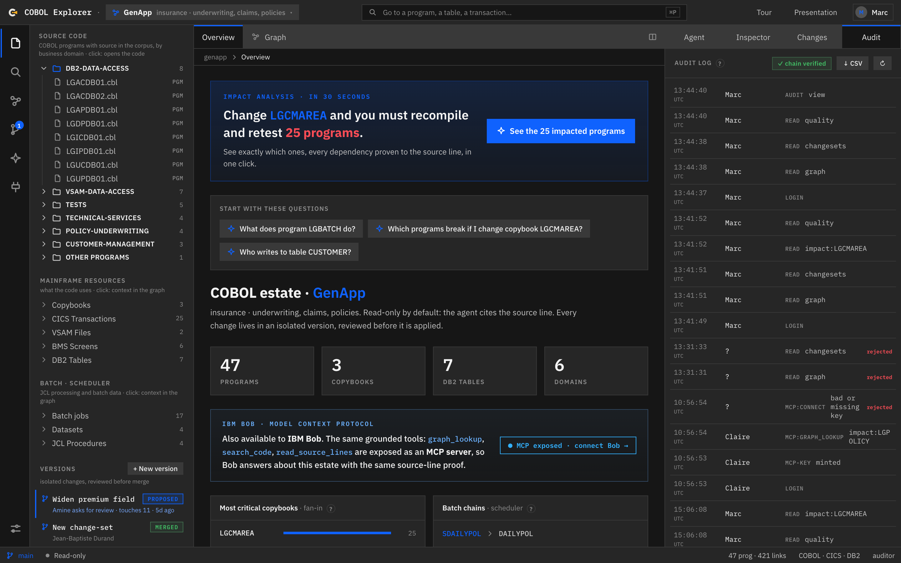
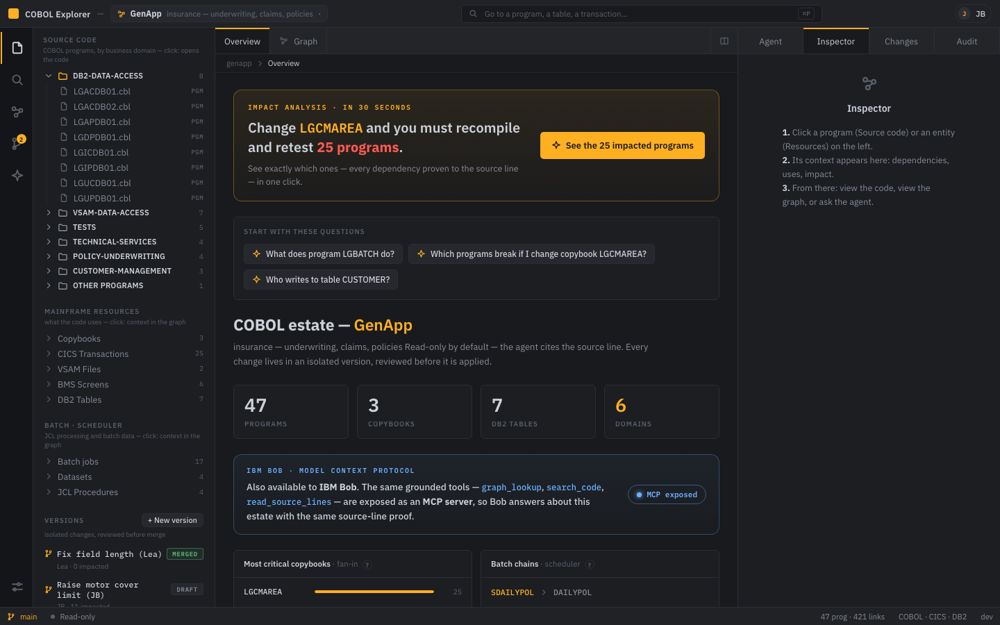
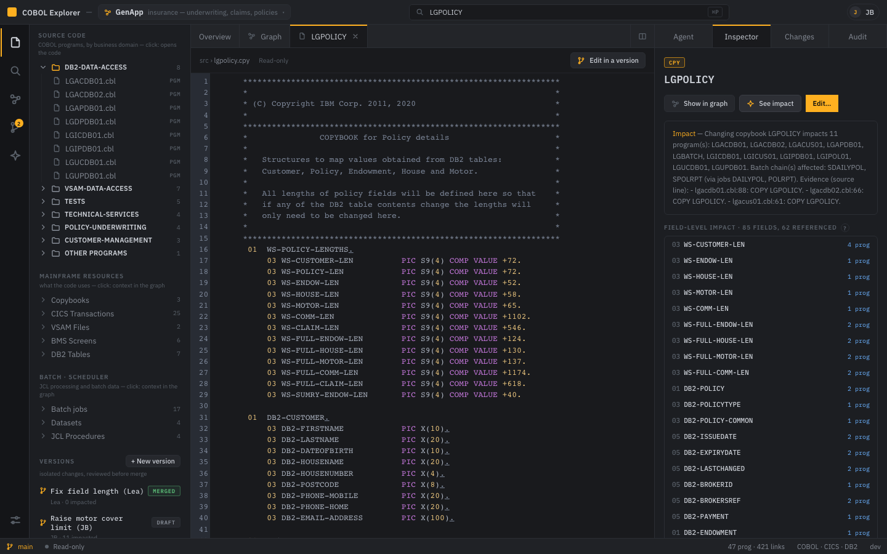
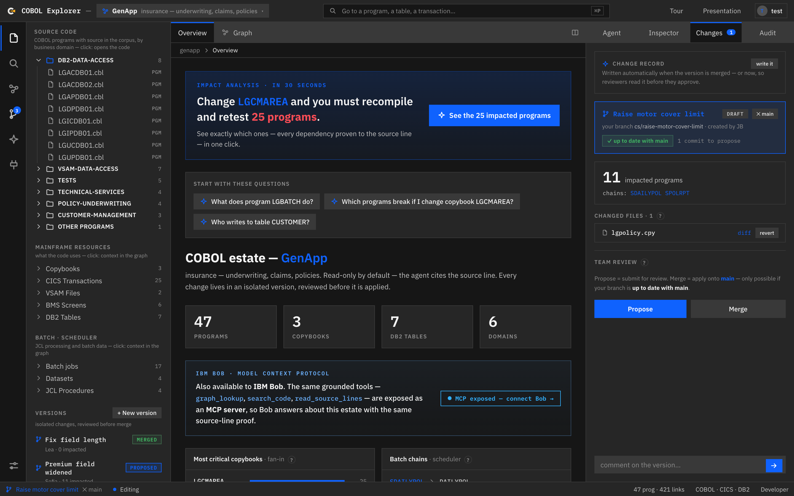

<div align="center">

# COBOL Explorer
### The AI co-worker for mainframe teams - it plans the blast radius of a change,
### grounds every decision to the source line, and hands its tools to IBM Bob over MCP

*Grounded agentic RAG + a mainframe-native graph - every answer traced back to the source line.*

**IBM AI Builders Challenge with IBM Bob** · **Wildcard Challenge - Build Intelligent Systems for the Future of Work**

[](https://cobol-explorer.fr)
[](https://youtu.be/oYf4kgc3fRo)
[](#8-tests)
[](https://github.com/JeanBaptisteDurand/cobol-explorer/actions/workflows/tests.yml)
[](https://www.ibm.com/granite)
[](#72-connect-your-own-ibm-bob-mcp)
[](LICENSE)

</div>

---

**Thirty seconds, five criteria** ·
**Technical execution**: 15,000+ lines, 209 automated tests, live in production ·
**Innovation**: one estate-scale ground truth that humans *and* IBM Bob query through the same governed tools ·
**Feasibility**: `make setup` installs it on any COBOL estate; the demo runs today at [cobol-explorer.fr](https://cobol-explorer.fr) ·
**Challenge fit**: plan, coordinate, decide, execute - the Wildcard theme is literally the on-screen workflow, for humans and AI alike ·
**Real-world impact**: days of manual impact hunting down to thirty seconds, with proof a regulator can replay

---

**Contents** ·
[The submission](#-ai-builders-challenge-with-ibm-bob---submission-wildcard):
[Problem](#problem-statement) ·
[Solution](#solution-description) ·
[AI approach](#ai-approach-and-architecture) ·
[Challenge theme](#selected-challenge-theme) ·
[How Bob was used](#how-ibm-bob-was-used) ·
[Try it](#try-it) ·
[Limitations](#known-limitations)
&nbsp;&nbsp;|&nbsp;&nbsp; **The product**:
[Overview](#overview) ·
[Two gestures](#1-the-product-in-two-gestures) ·
[What it maps](#2-what-the-product-maps-the-mainframe-elements) ·
[Interface](#3-the-surfaces-of-the-interface) ·
[The agent](#4-the-agent-and-all-its-tools) ·
[IBM stack](#5-the-ibm-stack) ·
[Architecture](#6-architecture) ·
[Getting started](#7-getting-started) ·
[Connect your Bob](#72-connect-your-own-ibm-bob-mcp) ·
[Tests](#8-tests) ·
[Layout](#9-repository-layout) ·
[Docs](#10-documentation) ·
[Positioning](#11-positioning)

---

## 🏆 AI Builders Challenge with IBM Bob - submission (Wildcard)

> An **AI co-worker + decision-intelligence platform** that turns work on legacy mainframe code - today a set of disconnected, expert-dependent tasks - into an **intelligent, governed, outcome-driven system** for a whole team (developers · risk · compliance). Built with IBM Bob - and extending IBM Bob back, over MCP.

### Problem statement

Legacy mainframe estates (COBOL / z/OS) still run the world's banks, insurers and public services - **200+ billion lines of COBOL in production**. But the *work* of understanding and safely changing them is stuck in the past: **disconnected, manual, expert-dependent tasks** - grep the files, ask a graybeard who is about to retire, then *guess* the blast radius of a change. Non-technical **risk and compliance** teams cannot read the code at all. Every change is a gamble, because its true impact is unknowable - and "found 8 of 14 impacted programs" is a production incident.

### Solution description

**COBOL Explorer** ingests the whole estate (COBOL, JCL, CICS, DB2, BMS, scheduler) into a **dependency graph**, and lets anyone - developer or business - ask questions in natural language and get answers **grounded to the exact source line**. It turns disconnected tasks into an outcome-driven system across the four "Future of Work" verbs:

- **Plan** - exhaustive, deterministic **impact analysis** ("changing this copybook breaks these N programs and these batch chains, with proof").
- **Coordinate** - **team versioning**: isolated branches, affected owners, review, merge gate.
- **Decide** - grounded, cited, exhaustive answers (decision support), not a plausible sample.
- **Execute** - **propose** an isolated change → measure impact → **governed merge** → tamper-evident audit.

### AI approach and architecture

- **Agentic RAG** - a **BeeAI** `RequirementAgent` on **IBM Granite** (ReAct loop); the agent chooses which tool to call and logs *why* (a `think` step), so its reasoning is auditable.
- **Two complementary RAGs** - a **graph RAG** (deterministic traversal → exact impact / lineage / call graph) and a **vector RAG** (**IBM Granite embeddings** → semantic search by intent). The agent routes between them.
- **Grounding / anti-hallucination** - every answer cites `file:line`; the server re-verifies each citation against the corpus and flags any that does not resolve.
- **IBM Bob via MCP** - 3 tools (`graph_lookup`, `search_code`, `read_source_lines`) exposed over the Model Context Protocol, so **Bob itself becomes an AI co-worker** that can query the estate.
- **Governance** - git-backed team versioning, RBAC roles, merge gate, HMAC-chained immutable audit.
- **Multi-estate** - analyses **two real codebases**: IBM **GenApp** (insurance) and AWS **CardDemo** (credit cards), switchable in one click.
- **Stack** - Python / FastAPI (agent + ingestion) + React / TypeScript (frontend); Granite self-hosted through Ollama, or **Granite on IBM watsonx.ai**. In-process graph and index by default; **Neo4j + pgvector (HNSW)** as the self-hosted scale path (`make serve-scale`). 158 backend tests · 51 e2e.

### Selected challenge theme

**Wildcard - *Build Intelligent Systems for the Future of Work*.** COBOL Explorer is a **decision-intelligence platform** and **AI co-worker** for the millions of people who maintain the systems that run critical infrastructure: it uses AI to **reduce repetitive work** (manual impact hunting), **improve decision-making** (exhaustive grounded impact), and **help teams reach outcomes faster** (a governed collaboration workflow) - spanning technical and non-technical roles.

Judged outside the Wildcard, the entry stands on its own merits: as a use of technology - the entire AI layer is IBM (Granite reasoning, Granite embeddings, BeeAI orchestration, watsonx.ai inference in production, and three MCP tools that extend IBM Bob itself) - and as an innovation: a deterministic graph RAG whose every model-written citation is re-verified against the source before a human relies on it.

On **feasibility**: this is not a slide deck. It runs today at [cobol-explorer.fr](https://cobol-explorer.fr) on watsonx.ai, installs locally with one command (`make demo`, no key and no Docker), and the path from this proof of concept to an enterprise deployment (industrial parsing, Gitea review, incremental ingestion, sovereign LLM) is written down in [docs/INDUSTRIALISATION.md](docs/INDUSTRIALISATION.md).

### How IBM Bob was used

IBM Bob was the **primary development tool** for this project, in three distinct roles: reviewer
of the analysis the product stands on, integrator of its parts, and finally a consumer of the
result over MCP.

**1. Bob verified the COBOL analysis itself.** The product's core claim is a dependency graph
extracted from COBOL, JCL and CICS sources, and a wrong graph would make every answer above it
wrong. Bob reads COBOL natively, so it was used as the independent reviewer of that analysis:
Bob was asked to trace the same dependencies directly in the raw sources (which programs COPY a
copybook, which EXEC SQL statements touch a table, which CALL and CICS LINK chains exist) and its
reading was compared with what the graph claimed. Every disagreement meant a parser bug or a
missing edge, and each one became a fix and a regression test. The graph a juror queries today is
the one that passed that review.

**2. Bob wired the parts together.** The system is several moving pieces: the parsers, the typed
graph, the semantic index, the BeeAI agent and its tools, the FastAPI service, the git-backed
version store and the React workshop. Bob did the integration work between them: aligning the
interfaces where components meet, connecting the agent's tools to the graph and the corpus, and
plugging the frontend panels onto the API routes they consume. The working style follows the July
lab: state the intent, review Bob's plan, then implement, with test-first discipline throughout.

**3. The loop closes: Bob consumes what Bob helped build.** The same three analysis tools
(`graph_lookup`, `search_code`, `read_source_lines`) are exposed back to IBM Bob over MCP
(`.bob/mcp.json`). A developer working inside Bob asks *"what breaks if I change LGPOLICY?"* and
Bob calls `graph_lookup`, returning the exhaustive, grounded impact that a file-reading agent
alone cannot guarantee.

**The evidence, on screen** ([bob-evidence/](bob-evidence/) holds the full set):

| Bob invokes the tool, human approves | The exhaustive, line-proven answer |
|---|---|
|  |  |



**4. IBM SkillsBuild:** *"Troubleshoot Your Code Using IBM Bob"* completed (3 Aug 2026); the
certificate is [in this repository](docs/skillsbuild-certificate.pdf) and uploaded with the entry.

**5. Where this goes after the hackathon: the loop inverts.** Today Bob calls COBOL Explorer's
tools. The natural upgrade is the reverse: COBOL Explorer as the **control plane for a fleet of
Bobs**. The estate already knows its own risks (the critical copybooks, the dead code, the
proposals waiting for review), so it can dispatch agents on routines: a nightly impact sweep after
every merge, one Bob per proposed change drafting the review before a human reads it, a dead-code
hunter opening cleanup versions on its own. Each agent works inside the same governance the humans
use: its own branch, the merge gate, the audit chain under its own name. The platform stops being
a tool an AI calls and becomes the manager of AI co-workers, which is the Future of Work claim
taken to its conclusion.

### Try it

**Live: [cobol-explorer.fr](https://cobol-explorer.fr)** - create an account, or sign in with the demo account
`amine` / `demo`. The agent runs on `ibm/granite-4-h-small` hosted on watsonx.ai (Dallas).

A **guided tour** starts on first sign-in and can be replayed from the header; the argument behind the
product is on **[/presentation](https://cobol-explorer.fr/presentation)**.

### Known limitations

Stated plainly, because a reviewer will find them anyway:

- **Accounts are file-based** (demo grade). A real deployment plugs in the corporate IdP - the token and RBAC path
  is unchanged, only the account source moves.
- **One active estate per process.** Switching between GenApp and CardDemo is a process-wide setting, so the public
  demo is effectively single-session.
- **Neo4j covers the traversals**, but name resolution and node attributes are still served from the in-memory
  index; full decoupling is a fast-follow.
- **The scheduler chains for GenApp are synthetic** (a JSON export standing in for IWS/Control-M). CardDemo's batch
  is real.
- **Embeddings are Granite through Ollama**, not watsonx - the corpus is not re-embedded when the chat backend
  switches.

**Deliverables** - public GitHub repo (this) · demo/presentation video (≤ 3 min) · each member completes an IBM SkillsBuild "IBM Bob" activity.

---

> "The AI does not talk to the mainframe. It talks to a graph and an index built from the code, the JCL and the
> scheduler - and every answer is traced back to the exact source line."

## Overview

**The platform - a VS Code-style workshop (activity bar, explorer, tabbed editor, agent panel).**



| The estate graph - impact radius of a copybook | The governed change - diff, impact and merge gate |
|---|---|
|  |  |

> From the graph: **click** a node to select it (the inspector shows its context), **double-click** or the `‹›` icon
> opens the code in a centre tab. Tabs are mixed (overview · graph · code · diff).

The plates above are regenerated from the running application by `make shots`, so they cannot drift into pictures of
a product that no longer exists.

---

## 1. The product, in two gestures

The product cleanly separates **understanding** (no side effects) from **changing** (isolated, traced, reviewed).

### 🔎 Query / understand

Explore and question the estate **without ever touching it**: navigation, reading the code, dependencies, impact,
and an **agent** that answers by citing source lines. All of it is read-only by construction, not by policy.

### ✎ Change - through workflows (change-sets)

Every modification lives in an **isolated version** (a change-set, like a branch or PR): you edit the code, you
**see the impact** (programs and batch chains affected), you compare with a **diff**, you **comment** and you
**review** (status *draft → proposed → merged*). **The source corpus is never mutated** - edits live in
`versions/<id>/files/`. This is the workflow "propose a change (for instance an insurance value that moves) →
measure its impact before applying it".

> The two gestures reinforce each other: *understand → propose a change → see the impact → review.*

---

## 2. What the product maps (the mainframe elements)

The graph is **mainframe-native**: it does not show "some COBOL", it shows the real estate.

**Nodes:**
`business DOMAIN` · `PROGRAM (COBOL)` · `PARAGRAPH` · `COPYBOOK` · `DB2 TABLE` · `CICS TRANSACTION` · `BMS SCREEN` · `JOB (JCL)` · `STEP` · `PROC` · `DATASET / GDG` · `SCHEDULER CHAIN`

**Edges, each carrying its own *evidence* (file:line, DDNAME, verb):**
`contains` · `executes` · `calls` (CALL + CICS LINK) · `copies` (data | procedure + REPLACING) · `reads/writes a DB2 table` (EXEC SQL) · `reads/writes a dataset` (SELECT↔DD↔DSN lineage) · `triggers` / `precedes` (scheduler) · `groups by domain`

This is what makes possible the answers a "RAG over code" cannot give: **batch data lineage**, **scheduler chains**,
and **impact analysis by copybook** ("changing this copybook breaks these N programs and these chains").

Two real estates are ingested: **GenApp** (339 nodes / 421 edges) and **CardDemo** (1157 nodes / 1294 edges).

> 📐 **Coverage of the mainframe universe** (what is mapped versus IMS/MQ/CICS resources/PL-I/Assembler/RACF… and
> the roadmap): see [docs/MAINFRAME-COVERAGE.md](docs/MAINFRAME-COVERAGE.md). The schema (typed
> nodes and edges) is **agnostic of language and subsystem**: extending it means adding a `kind` and a parser, not a
> rewrite.

---

## 3. The surfaces of the interface

An IDE-style cowork workshop, in three columns:

| Surface | What it shows |
|---|---|
| **Overview** (tab) | Orientation: estate statistics, **top copybooks by fan-in** (criticality), **batch chains** from the scheduler, questions to start from |
| **Source code** (left) | The estate tree **by business domain** (programs, copybooks) + search + the list of **versions** |
| **Connect your Bob** (left) | The three MCP tool signatures, where the server runs, and the configuration to paste - see [§7.2](#72-connect-your-own-ibm-bob-mcp) |
| **Code editor** (tab) | COBOL inline - **CodeMirror**, highlighting, line numbers, multi-file tabs |
| **Graph** (tab) | Dependency graph **grouped by domain**, edges **coloured by semantics** (calls, copybooks, SQL, execution) |
| **Inspector** (right) | The context of one entity: **clickable dependencies with line numbers** (calls, copybooks, tables, used-by, called-by) + grounded **impact analysis**, down to the field level |
| **Agent** (right) | The agent: **grounded** answer, **tool-call trace**, `file:line` citations |
| **Changes** (right) | The cowork review: the version's **changed files** + **diff** + impact + **Propose / Merge / comment** |
| **Audit** (right) | The HMAC-chained log: every query, read, change **and refusal** |
| **Command bar** (top) | Global search, ⌘P palette (exact + semantic), statistics, active version, guided tour |
| **Status bar** (bottom) | The branch you are in and whether you are Read-only or Editing - always visible |

A **guided tour** (driver.js, 17 steps) runs on first sign-in and can be replayed from the header. The public
argument lives at **`/presentation`**, reachable from inside the workshop.

---

## 4. The agent and all its tools

A **BeeAI `RequirementAgent`** on IBM Granite, ReAct loop, **every tool call traced** (auditable grounding, streamed
over SSE). It is instructed to **ask a clarifying question** when the request is ambiguous.

| Tool | What it does |
|---|---|
| `graph_lookup` | Queries the graph: **impact**, **lineage**, **callers**, **callees**, **neighbours** (deterministic) |
| `search_code` | **Semantic search** over the code (IBM **Granite embeddings**) - combinable with `graph_lookup` (vector + graph) |
| `read_source_lines` | Reads the **exact source lines** so an answer can cite `file:line` |
| `web_search` | External context (regulation, definitions) - Tavily or DuckDuckGo |
| `propose_change` | **Creates a version** (change-set) proposing an edit and **computes its impact** - from the chat |

The first three (`graph_lookup`, `search_code`, `read_source_lines`) are **exposed over MCP** and therefore usable
directly from **IBM Bob**.

---

## 5. The IBM stack

| Layer | IBM technology | Used for |
|---|---|---|
| **Reasoning (LLM)** | **IBM Granite** - `granite3.3:8b` self-hosted, or `ibm/granite-4-h-small` on **watsonx.ai** | the agent's brain |
| **Embeddings / search** | **IBM Granite Embedding** (`granite-embedding:278m`) | the `search_code` semantic search |
| **Agent framework** | **BeeAI** (`RequirementAgent`) | ReAct orchestration + trace |
| **Identity** | **IBM Cloud App ID** (OIDC) | "Sign in with IBM" - see [§7.4](#74-sign-in-with-ibm-oidc--ibm-cloud-app-id) |
| **Dev assistant** | **IBM Bob** | (1) the build co-pilot; (2) an **MCP client** of our tools |

**Tool protocol**: **MCP** - an *open* standard (Anthropic), **adopted by IBM Bob**. Our tools are exposed over MCP
and consumable by any MCP client.

**Neutral (no relevant IBM equivalent)**: in-house targeted extraction (COBOL/JCL/CICS parsing), cobol-rekt
(optional validator, non-IBM), FastAPI/React/CodeMirror/NetworkX (plumbing), Tavily/DuckDuckGo (web search).
**IBM options on the roadmap**: Docling (document ingestion), MCP **Context Forge** (MCP gateway),
**watsonx.governance** (audit).

> Everything runs **locally and for free** with Ollama - reproducible by a student - or against watsonx.ai for
> production latency.

---

## 6. Architecture

```
INGESTION (offline, Python)
  COBOL/JCL corpus ─► targeted construct extraction (COBOL COPY/CALL/EXEC CICS/EXEC SQL/
                      SELECT-ASSIGN/SEND-MAP, JCL JOB/STEP/DD, CSD transactions, BMS maps)
                      ─► graph.json (NetworkX)  ─► chunks ─► IBM Granite embeddings ─► index.json
                      (cobol-rekt = OPTIONAL off-graph validation/enrichment, needs a JDK)
SERVICE (Python)
  FastAPI  ── /graph /impact /source /file /search ── /ask (SSE) ── /changesets…
     └─ BeeAI agent (IBM Granite): graph_lookup · search_code · read_source_lines · web_search · propose_change
     └─ MCP server ── the same tools, consumable by IBM Bob
     └─ Security: RBAC · signed tokens · HMAC-chained audit log
  Versioning: isolated change-sets + impact + diff + review (collaboration)
FRONTEND (React + CodeMirror + React Flow) - IDE/cowork workshop
  left (tree · versions · Bob) · tabs (Overview / Code / Graph / Diff) · right (Agent / Inspector / Changes / Audit)
  public landing + /presentation, IBM Carbon design language
```

## 7. Getting started

```bash
make setup    # venv (uv) + Python deps + frontend deps
make ingest   # corpus -> graph.json (GenApp: 339 nodes / 421 edges; CardDemo: 1157 / 1294)
make index    # IBM Granite semantic index -> index.json
make web      # build the frontend
make serve    # http://127.0.0.1:8000
# conversational agent: ollama serve & ; ollama pull granite3.3:8b granite-embedding:278m
make ask N=LGPOLICY   # grounded, traced answer from the CLI (no LLM required)
make mcp              # the MCP server for IBM Bob
```

### 7.1 Where Granite runs (Ollama or watsonx.ai)

The model is **always IBM Granite**; only where it executes changes, through `COBOL_EXPLORER_MODEL`:

| Value | Model | Execution | Measured agent latency |
|---|---|---|---|
| `ollama:granite3.3:8b` (default) | Granite 3.3 8B | **self-hosted**, on the machine - estate code never leaves it | ~30-40 s (CPU) |
| `watsonx:ibm/granite-4-h-small` | Granite 4.0 H Small | **IBM watsonx.ai** (Dallas region) | **~6.5 s** |

```bash
make serve            # Granite self-hosted through Ollama
make serve-watsonx    # Granite hosted by IBM watsonx.ai
```

For watsonx, set `WATSONX_API_KEY`, `WATSONX_PROJECT_ID` and
`WATSONX_URL=https://us-south.ml.cloud.ibm.com` (in `.env`, not versioned). The watsonx project must have a
**watsonx.ai Runtime** service associated with it, otherwise the call fails with a 403
`no_associated_service_instance_error` - an error that does not mention the real cause.

### 7.2 Connect your own IBM Bob (MCP)

The three analysis tools are exposed over the **Model Context Protocol**, so Bob calls them instead
of reading files and guessing. Two paths, and the short one takes two minutes with nothing to
install.

#### The two-minute path: the hosted demo estate

1. **Generate your key.** Sign in at [cobol-explorer.fr](https://cobol-explorer.fr) (demo account
   `amine` / `demo`), open the sidebar's plug icon ("Connect your Bob"), generate your personal
   key. It is shown once - and every call Bob makes is written to the estate's audit trail under
   your name. (On the shared demo account, re-minting replaces the previous key; your own account
   gives you your own.)
2. **Download the connector:** [`mcp/cobol-explorer-mcp.py`](mcp/cobol-explorer-mcp.py) (also served
   at [cobol-explorer.fr/downloads/cobol-explorer-mcp.py](https://cobol-explorer.fr/downloads/cobol-explorer-mcp.py)).
   One file, plain `python3`, standard library only.
3. **Register it** in your MCP configuration (`.bob/mcp.json` in a workspace, or the global MCP
   settings):

```json
{
  "mcpServers": {
    "cobol-explorer": {
      "command": "python3",
      "args": ["/absolute/path/to/cobol-explorer-mcp.py"],
      "env": { "COBOL_EXPLORER_MCP_KEY": "ce_..." }
    }
  }
}
```

   If your client supports remote MCP servers natively, skip the file entirely:
   `{ "url": "https://cobol-explorer.fr/mcp", "headers": { "Authorization": "Bearer ce_..." } }`.

4. **Ask the first question:** *"what breaks if I change LGPOLICY?"*. Eleven programs and two batch
   chains means `graph_lookup` answered - and the call already sits in the Audit panel, under your
   name. A plausible handful means the agent is still reading files.

#### Your own estate, locally

The hosted endpoint serves the public demo estates. To run the same tools against **your own
COBOL** - which then never leaves your machine, which is the only reason a bank would let an agent
near it - use the local stdio server the repository ships:

```bash
git clone https://github.com/JeanBaptisteDurand/cobol-explorer
cd cobol-explorer
make setup
```

Then drop your sources under `corpora/` and run `make ingest`: the graph the tools traverse is
rebuilt from **your** estate. Skip that step to explore the two demo estates first.
`.bob/mcp.json` ships with the repository, so Bob finds the local server on its own; its entry
carries an `env` block that is not optional - without `PYTHONPATH` the module is not importable
and `python -m mcp_server.server` exits before it speaks.

**Check it worked** the same way in both paths: the LGPOLICY question, the eleven programs.

### 7.3 Sign-up and address verification

Sign-up is open (`POST /api/signup`). If an SMTP relay is configured, the account is created **unverified** and a
single-use confirmation link (24 h) is emailed; sign-in is refused with a 403 until it is clicked. **Without a relay
configured, verification is disabled** and the visitor goes straight in - and the API says so
(`/api/auth/config` → `email_verification: false`), so the interface never claims to have sent an email it did not
send.

No third-party service: plain SMTP, with the domain's own mailbox.

```bash
COBOL_EXPLORER_SMTP_HOST=smtp.ionos.fr
COBOL_EXPLORER_SMTP_PORT=587            # 587 STARTTLS · 465 implicit TLS
COBOL_EXPLORER_SMTP_USER=noreply@cobol-explorer.fr
COBOL_EXPLORER_SMTP_PASSWORD=...
COBOL_EXPLORER_SMTP_FROM="COBOL Explorer <noreply@cobol-explorer.fr>"
COBOL_EXPLORER_PUBLIC_URL=https://cobol-explorer.fr
```

### 7.4 "Sign in with IBM" (OIDC / IBM Cloud App ID)

Two OAuth 2.0 exchanges coexist in this project, and they should not be confused:

| | Who | What |
|---|---|---|
| **Machine to machine** | `ibm_watsonx_ai` | the API key is exchanged for an IAM token (`grant_type=urn:ibm:params:oauth:grant-type:apikey`) to call Granite |
| **Human** | `security/oidc.py` | a **person** signs in through **IBM Cloud App ID** (authorization code), and their claims are mapped onto the same signed token the rest of the app uses |

The role granted to an IBM sign-in is deliberately **the least privileged that is still useful**
(`risk`: read and propose, never merge). Federating an identity says *who* someone is, not what they are allowed to
do here - that stays a decision of this deployment.

The token comes back to the SPA **in the URL fragment**: a fragment is never sent to the server, so it appears in no
access log and in no `Referer` header. It is read once and then erased from the address bar. The CSRF state is
**signed** rather than stored (valid 10 minutes), so a restart does not fail the sign-ins already in flight.

```bash
COBOL_EXPLORER_OIDC_TENANT=<App ID tenant GUID>
COBOL_EXPLORER_OIDC_REGION=us-south
COBOL_EXPLORER_OIDC_CLIENT_ID=...
COBOL_EXPLORER_OIDC_SECRET=...
COBOL_EXPLORER_OIDC_ROLE=risk
```

Without these variables the button is not offered (`/api/auth/config` → `ibm_sign_in: false`). Branding the hosted
sign-in widget is documented in [docs/IBM-APPID-BRANDING.md](docs/IBM-APPID-BRANDING.md).

### 7.5 Authentication modes (who is the user?)

The server runs in one of three modes, through `COBOL_EXPLORER_AUTH`:

| Mode | Identity | For what |
|---|---|---|
| `open` (default) | declarative `X-Cobol-User` / `X-Cobol-Role` headers | demo - `make serve`, nothing to configure |
| `jwt` | **login + HS256 signed token** issued by `/api/login` | standalone deployment - `make serve-auth` |
| `enforce` | headers injected by a trusted SSO reverse proxy | the enterprise keeps authentication outside the app (OIDC/SAML) |

In `jwt` mode the **role travels inside the signed token**: a client cannot promote itself by changing a header,
RBAC arbitrates from the claims, and every attempt - allowed, refused or rejected - goes into the chained audit log.
Passwords are never stored (PBKDF2-HMAC-SHA256, 120,000 iterations, per-account salt).

```bash
make serve-auth   # the same app, with real authentication enabled
# demo accounts (password: demo) - one per gesture, so RBAC can be seen to bite:
#   amine (dev) · claire (architect) · sofia (risk) · marc (auditor, read-only)
```

The audit chain is keyed: set `COBOL_EXPLORER_AUDIT_SECRET` in any real deployment - with the
demo default, tamper evidence holds against everyone except whoever can read this repository,
and the server logs a warning when auth is on but the key is the demo one.

For real accounts, point `COBOL_EXPLORER_USERS` at a JSON `{user: {display, role, password_hash}}`
(hash through `security.users.hash_password`), and set `COBOL_EXPLORER_JWT_SECRET` so tokens survive a restart.

## 8. Tests

```bash
make test                           # 158 backend tests (parsing, graph, impact, search, versioning, API, MCP, auth, sign-up)
cd web && pnpm exec playwright test # 51 e2e (landing, sign-up, sign-in, overview, code, impact, cowork, tour, RBAC)
make serve-sandbox &                # authenticated server on a THROWAWAY COPY of the estate
make e2e-governance                 # a 3-account / 3-role scenario played in the browser
make shots                          # re-capture the product plates this README and the landing page carry
```

## 9. Repository layout

```
corpora/          the GenApp estate (COBOL, JCL, BMS, CSD) + domains.yaml + scheduler.json
systems/          the second estate (CardDemo) with its own graph and index
ingestion/        parsers: COBOL, JCL, CICS, DB2, BMS, scheduler -> graph.json
packages/core/    the shared graph model and traversals (impact, lineage, callers)
server/
  api/            FastAPI: graph, impact, source, search, /ask (SSE), change-sets, audit
  agent/          the BeeAI agent, its tools, the vector index
  mcp_server/     the MCP server exposing the three tools to IBM Bob
  security/       RBAC, identity, signed tokens, OIDC, users, the audit chain
  versioning/     isolated change-sets, diff, review, merge gate
  tests/          158 backend tests
web/              React + TypeScript frontend (workshop, landing, /presentation)
  e2e/            51 Playwright tests
versions/         isolated change-sets - the source corpus is never mutated
docs/             design, coverage, industrialisation, demo guide
.bob/mcp.json     the MCP entry IBM Bob reads
```

## 10. Documentation

| Document | What is in it |
|---|---|
| [docs/DESIGN.md](docs/DESIGN.md) | The design language: IBM Carbon tokens, typography, the rules the interface follows |
| [docs/MAINFRAME-COVERAGE.md](docs/MAINFRAME-COVERAGE.md) | What is mapped versus IMS/MQ/PL-I/Assembler/RACF, and the roadmap |
| [docs/INDUSTRIALISATION.md](docs/INDUSTRIALISATION.md) | What moving from demo to production would take |
| [docs/GUIDE_DEMO.md](docs/GUIDE_DEMO.md) | How to run the demo |
| [docs/IBM-APPID-BRANDING.md](docs/IBM-APPID-BRANDING.md) | Branding the IBM Cloud App ID sign-in widget |

## 11. Positioning

- versus **watsonx Code Assistant for Z**: a **complement** (human understanding and onboarding), not a competitor.
- versus **Phase Change** ("deterministic graph"): we add **auditable agentic reasoning** (the tool-call trace) on
  top of a deterministic graph.

License: **Apache 2.0**.
